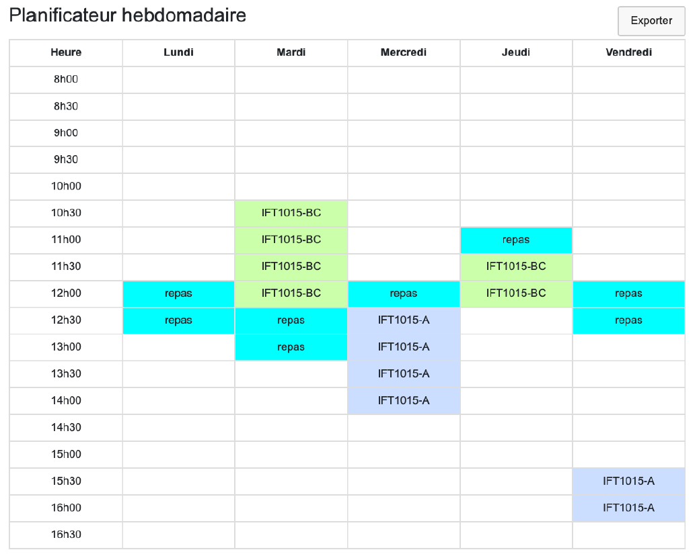

## Aperçu

    

## Description.

Il s'agit de l'implémentation d'une application Web d'horaire hebdomadaire dans l'environnement **codeBoot**. Ce code est écrit en Python.
Il a été écrit dans le cadre d'un travail pratique du cours **IFT 1015: Introduction à la Programmation**.

L'utilisateur à la possibilité d'ajouter des événements avec une gestion robuste des erreurs. Il a aussi la possibilité d'ajouter d'importer un horaire sous un format particulier dans un fichier csv avec un glisser-déposer et aussi la possibilité d'exporter son horaire formé sous le même format pour des utilisations ultérieures.

## Auteurs

- **Josué Mongan**  
  GitHub : [Josh012006](https://github.com/Josh012006)  
- **Kuzatw**  
  GitHub : [kuzatw](https://github.com/kuzatw)

## Droits d'auteurs

En raison de la politique de lutte contre le plagiat de l'Université, ce code **n'est pas libre d'utilisation**.
S'il advient que vous vous en serviez pour exécuter un quelconque travail, **veuillez clairement le mentionner ainsi que les auteurs**.